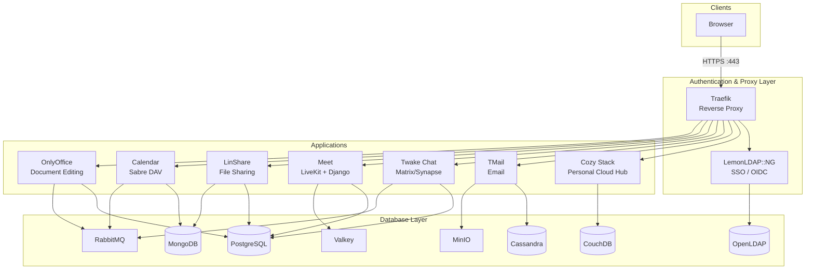
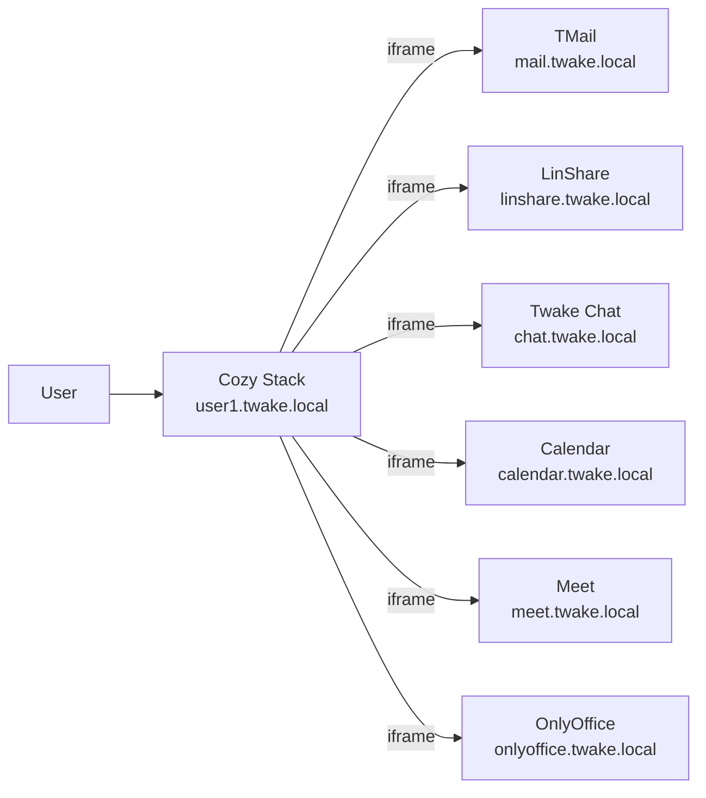

## Layered design

Twake Workplace Docker is organized into **9 operational layers**, each defined as a separate Docker Compose project. A shared external network (`twake-network`) connects them all.



## Layer overview

| Layer        | Compose project  | Purpose                                                                                        |
| ------------ | ---------------- | ---------------------------------------------------------------------------------------------- |
| Database     | `twake_db`       | All backing stores: PostgreSQL, MongoDB, CouchDB, OpenLDAP, Valkey, RabbitMQ, Cassandra, MinIO |
| Auth & Proxy | `twake_auth`     | Traefik reverse proxy, LemonLDAP SSO, Docker socket proxy                                      |
| Cozy Stack   | `cozy_stack`     | Personal cloud hub that integrates all apps                                                    |
| OnlyOffice   | `onlyoffice_app` | Collaborative document editing                                                                 |
| Meet         | `meet_app`       | Video conferencing (LiveKit + Django backend)                                                  |
| LinShare     | `linshare_app`   | Secure file sharing and storage (Tomcat + ClamAV)                                              |
| Calendar     | `calendar_app`   | Calendar, contacts, and account management (Sabre DAV)                                         |
| Chat         | `chat_app`       | Matrix/Synapse homeserver + Twake Chat frontend                                                |
| Email        | `tmail_app`      | TMail (Apache James) with JMAP, SMTP, and IMAP                                                 |

## Startup order

The `wrapper.sh` script enforces a strict startup sequence with health checks between each layer:

```
twake_db --> twake_auth --> cozy_stack --> onlyoffice_app --> meet_app --> calendar_app --> chat_app --> tmail_app
```

`linshare_app` is not managed by the wrapper and must be started separately (its images require authentication to `docker-registry.linagora.com`).

Services that depend on LemonLDAP (`chat_app`, `tmail_app`) wait for it to become healthy before starting.

Shutdown runs in reverse order to avoid dangling connections.

## Networking

All containers share a single Docker network with a fixed subnet:

```bash
docker network create twake-network --subnet=172.27.0.0/16
```

**Traefik** is the sole entry point, bound to ports 80 and 443 with a static IP (`172.27.0.100`). It routes requests based on `Host` headers using Docker labels on each service.

Traffic flow:

1. Browser sends HTTPS request to `*.twake.local`
2. Traefik terminates TLS and routes to the target container
3. Containers communicate internally over `twake-network` using Docker DNS

### Routing examples

```yaml
# Chat frontend
traefik.http.routers.chat.rule: "Host(`chat.twake.local`)"

# Cozy Stack (flat subdomain model per user)
traefik.http.routers.cozy.rule: "HostRegexp(`{subdomain:user1|user2|user3}.twake.local`)"

# TMail JMAP API (priority-based routing)
traefik.http.routers.mail-backend-jmap.rule: "Host(`jmap.twake.local`)"
traefik.http.routers.mail-backend-jmap.priority: 300
```

## Cozy Stack as integration hub

Cozy Stack is the user-facing entry point. When a user navigates to `user1.twake.local`, Cozy Stack serves the home page and embeds the other applications (Mail, LinShare, Chat, Calendar, Meet) via iframes and app integrations.



This iframe-based integration is why [trusting the self-signed CA certificate](./getting-started#5-trust-the-ca-certificate) is critical.
