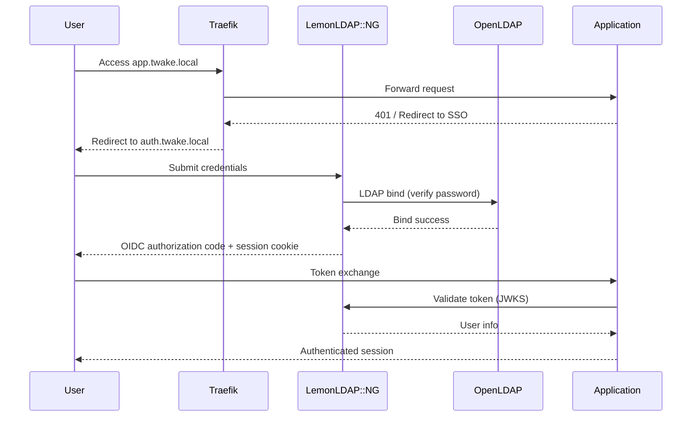

## Overview

Twake Workplace Docker uses **LemonLDAP::NG** as the single sign-on (SSO) provider. LemonLDAP authenticates users against OpenLDAP and issues OIDC tokens that downstream services consume.

There is no registration service or self-service signup. Users are pre-seeded in LDAP and authenticate through the SSO portal.

## Authentication flow



## OIDC endpoints

LemonLDAP exposes standard OIDC endpoints at `auth.twake.local`:

| Endpoint      | URL                 |
| ------------- | ------------------- |
| Authorization | `/oauth2/authorize` |
| Token         | `/oauth2/token`     |
| UserInfo      | `/oauth2/userinfo`  |
| JWKS          | `/oauth2/jwks`      |
| Logout        | `/oauth2/logout`    |

Each application (TMail, Meet, Chat, etc.) is registered as an OIDC relying party in LemonLDAP's configuration.

## LDAP user lookup

LemonLDAP authenticates users with the following LDAP filter:

```
(&(|(uid=$user)(mail=$user))(objectClass=inetOrgPerson))
```

Users can log in with either their **username** (`uid`) or **email address** (`mail`).

## Pre-seeded users

The LDAP directory is bootstrapped from `twake_db/ldap/bootstrap/users.ldif` with these test accounts:

| Username | Password    | Role          |
| -------- | ----------- | ------------- |
| `user1`  | `user1`     | Regular user  |
| `user2`  | `user2`     | Regular user  |
| `user3`  | `user3`     | Regular user  |
| `admin`  | `Admin@123` | Administrator |
| `test`   | `Test@123`  | Test account  |

All users are stored under `ou=users,dc=twake,dc=local`.

## LemonLDAP configuration

LemonLDAP is configured via a JSON file generated from a template (see [Configuration](./configuration#template-based-configuration) for how template substitution works).

Key configuration aspects:

- **Session management**: Active session timer, brute force protection
- **OIDC relying parties**: One per application (TMail, Meet, Chat, etc.)
- **Portal**: Accessible at `auth.twake.local`
- **Manager**: Administrative interface at `manager.twake.local`

## How services consume SSO

Each application integrates differently, but the pattern is the same: redirect unauthenticated users to LemonLDAP, exchange the authorization code for tokens, and validate the JWT using the JWKS endpoint.

| Service    | Integration method                    |
| ---------- | ------------------------------------- |
| TMail      | OIDC tokens for JMAP authentication   |
| Meet       | Django OIDC backend                   |
| Chat (TOM) | OIDC client credentials + user tokens |
| LinShare   | SSO cookie passthrough                |
| Calendar   | OIDC via Sabre DAV                    |
| Cozy Stack | OIDC proxy to LemonLDAP               |
